# Daily Reflection Tree — Branch Diagram

```mermaid
flowchart TD
    START([🌿 START\nGood evening...]) --> A1_OPEN

    subgraph AXIS1 ["🟡 Axis 1 — Locus of Control"]
        A1_OPEN[Q: How would you describe today?]
        A1_D1{Decision}
        A1_Q_HIGH[Q: What made things go well?]
        A1_Q_LOW[Q: What was your first instinct?]
        A1_D2{Decision}
        A1_D2B{Decision}
        A1_Q2_AGENCY[Q: Did you feel in control?]
        A1_Q2_LUCK[Q: How long did you dwell on blame?]
        A1_D3A{Decision}
        A1_D3B{Decision}
        A1_R_INT[/Reflection: You stayed in the driver's seat/]
        A1_R_EXT[/Reflection: Even choosing to wait is a choice/]
    end

    subgraph BRIDGE12 ["⬇ Bridge"]
        B12A[Bridge: Now let's look at what you gave]
        B12B[Bridge: What did you put in today?]
    end

    subgraph AXIS2 ["🟢 Axis 2 — Orientation"]
        A2_OPEN[Q: Giving or expecting today?]
        A2_D1{Decision}
        A2_Q_CONTRIB[Q: Did anyone notice your effort?]
        A2_Q_ENTIT[Q: Did you feel unseen?]
        A2_D2A{Decision}
        A2_D2B{Decision}
        A2_R_CONTRIB[/Reflection: You gave without scorekeeping/]
        A2_R_ENTIT[/Reflection: The ledger of what you're owed.../]
    end

    subgraph BRIDGE23 ["⬇ Bridge"]
        B23A[Bridge: How wide was your circle?]
        B23B[Bridge: Who else was in your view?]
    end

    subgraph AXIS3 ["🟣 Axis 3 — Radius of Concern"]
        A3_OPEN[Q: Whose face comes to mind first?]
        A3_D1{Decision}
        A3_Q_SELF[Q: What stressed you most?]
        A3_Q_OTHER[Q: Did work feel meaningful?]
        A3_D2A{Decision}
        A3_D2B{Decision}
        A3_R_OTHER[/Reflection: You looked beyond yourself/]
        A3_R_SELF[/Reflection: Meaning lives just outside that circle/]
    end

    SUMMARY_A([📋 Summary])
    SUMMARY_B([📋 Summary])
    END([🌿 See you tomorrow])

    A1_OPEN --> A1_D1
    A1_D1 -->|Productive / Mixed| A1_Q_HIGH
    A1_D1 -->|Tough / Frustrating| A1_Q_LOW
    A1_Q_HIGH --> A1_D2
    A1_Q_LOW --> A1_D2B
    A1_D2 -->|I prepared / I adapted| A1_Q2_AGENCY
    A1_D2 -->|Team / Lucky| A1_Q2_LUCK
    A1_D2B -->|Control / Push through| A1_Q2_AGENCY
    A1_D2B -->|Wait / Stuck| A1_Q2_LUCK
    A1_Q2_AGENCY --> A1_D3A
    A1_Q2_LUCK --> A1_D3B
    A1_D3A -->|Owned it| A1_R_INT
    A1_D3A -->|Day controlled me| A1_R_EXT
    A1_D3B -->|Moved to fixing| A1_R_INT
    A1_D3B -->|Kept replaying| A1_R_EXT
    A1_R_INT --> B12A --> A2_OPEN
    A1_R_EXT --> B12B --> A2_OPEN

    A2_OPEN --> A2_D1
    A2_D1 -->|Helped / Taught| A2_Q_CONTRIB
    A2_D1 -->|Needed support / Unnoticed| A2_Q_ENTIT
    A2_Q_CONTRIB --> A2_D2A
    A2_Q_ENTIT --> A2_D2B
    A2_D2A -->|Fine without credit| A2_R_CONTRIB
    A2_D2A -->|Wished noticed| A2_R_ENTIT
    A2_D2B -->|Reminded myself why| A2_R_CONTRIB
    A2_D2B -->|Bothered me| A2_R_ENTIT
    A2_R_CONTRIB --> B23A --> A3_OPEN
    A2_R_ENTIT --> B23B --> A3_OPEN

    A3_OPEN --> A3_D1
    A3_D1 -->|My own concerns| A3_Q_SELF
    A3_D1 -->|Team / Colleague / User| A3_Q_OTHER
    A3_Q_SELF --> A3_D2A
    A3_Q_OTHER --> A3_D2B
    A3_D2A -->|Own workload| A3_R_SELF
    A3_D2A -->|Team / User| A3_R_OTHER
    A3_D2B -->|Yes clearly| A3_R_OTHER
    A3_D2B -->|Not today| A3_R_SELF
    A3_R_OTHER --> SUMMARY_A --> END
    A3_R_SELF --> SUMMARY_B --> END
```

## Node Type Legend

| Symbol | Type | Description |
|--------|------|-------------|
| `[ ]` | question | Shown to user, waits for input |
| `{ }` | decision | Invisible routing node |
| `/  /` | reflection | Insight card shown to user |
| `(( ))` | start / end / summary | Session boundaries |
| Bridge | bridge | Transition between axes |

## Path Count

Every user takes exactly **1 of 8 possible paths** through the tree, determined entirely by their answers. Same answers = same path, every time.
